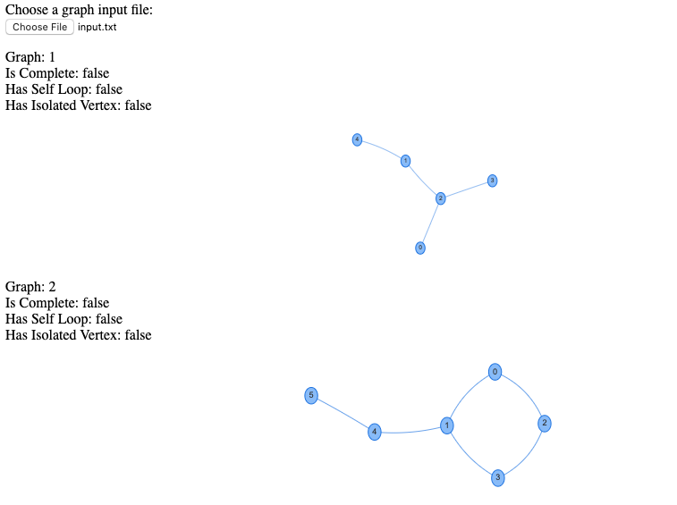

# Graph Visualization
## A tool for graph visulization with helpful info on each graph.

You can load an input file consisting of several graphs in the following format:

The first line must contain the number of nodes (N), the line after it contains the number of edges (E).
The next E lines contain the graph edges. The input terminates if the number of nodes N = 0.

Check input.txt for a sample input file.

